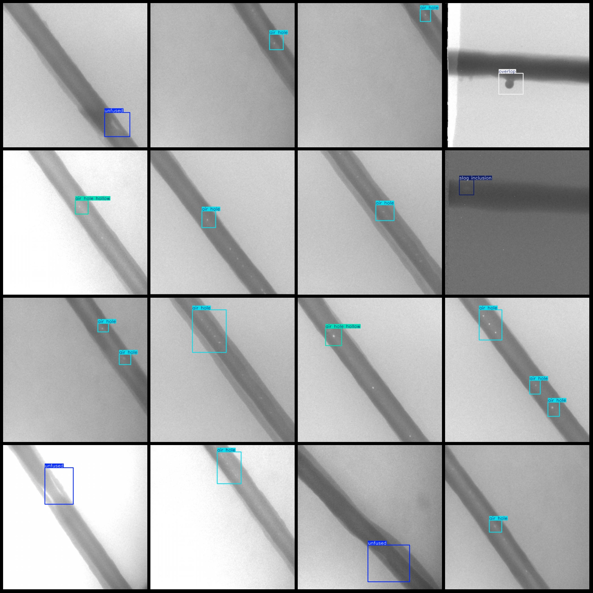
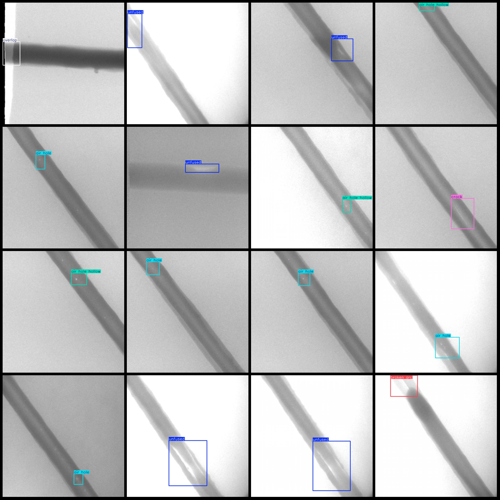

# X-ray images defect detection dataset in VOC+YOLO format with 3337 images in 8 categories

Dataset format: Pascal VOC format + YOLO format (txt files without split paths, only containing jpg images and corresponding VOC format xml files and YOLO format txt files)
Number of images (jpg file count): 3337
Number of annotations (xml file count): 3337
Number of annotations (txt file count): 3337
Number of annotation categories: 8
Annotation category names (notice that the order of categories in the YOLO format is not consistent with this, but according to the labels folder "classes.txt"): ["air hole", "air hole hollow", "bite edge", "broken arc", "crack", "overlap", "slag inclusion", "unfused"]
Each category has the number of boxes:
Air hole box count = 1601
Air hole hollow box count = 617
Bite edge box count = 34
Broken arc box count = 499
Crack box count = 115
Overlap box count = 212
Slag inclusion box count = 97
Unfused box count = 413
Total number of frames: 3588.
Image resolution: 640x640
LabelImg
Annotation rules: Draw a rectangle around categories.
Important Note: None
Special statement: This dataset does not guarantee the accuracy of the trained model or the weights file.
Image preview:
## Images

Here is a pay link on Stripe ( https://buy.stripe.com/3cs8yP7sY87d0vu9AB ). Please contact me lonlonago@foxmail.com after funding $89, and I will send you a complete data files , thank you!

